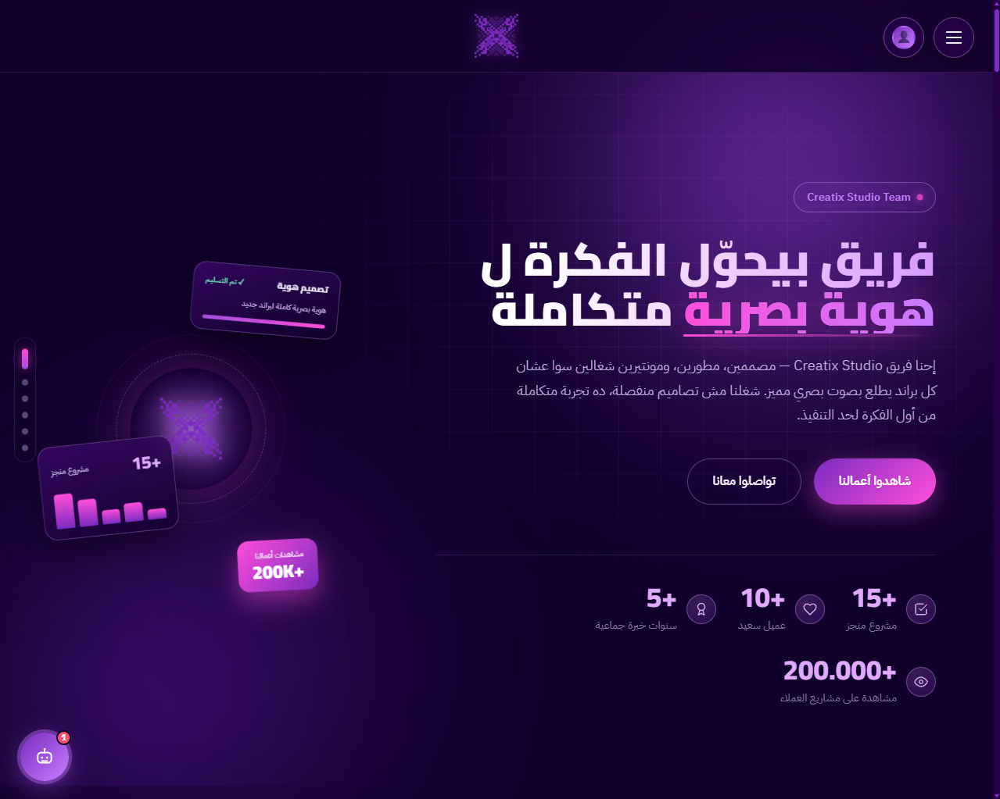

<div align="center">


# Creatix Studio

### A bilingual-ready, RTL-first agency website — design, development & video, all in one fast static page.

[](https://creatixstudio1.github.io)
[](https://github.com/creatixstudio1/creatixstudio1.github.io/stargazers)
[](https://github.com/creatixstudio1/creatixstudio1.github.io/fork)
[](https://github.com/creatixstudio1/creatixstudio1.github.io/commits)

**[🌐 View Live Demo](https://creatixstudio1.github.io)** &nbsp;•&nbsp; **[⭐ Star this repo](https://github.com/creatixstudio1/creatixstudio1.github.io)** &nbsp;•&nbsp; **[🇪🇬 النسخة العربية](#-نبذة-بالعربي)**

<br/>



</div>

---

## ⭐ Like what you see?

If this project inspired you, saved you time, or just looks good — **please give it a star**. It takes one second, costs nothing, and it's the best way to support independent creators and help others discover the project.

> **Click the ⭐ Star button at the top-right of this page. Thank you!**

---

## ✨ Overview

**Creatix Studio** is the official website of a creative agency based in Egypt offering **graphic design, web development, and video editing**. It's built as a single, dependency-free HTML file that is fast to load, easy to host, and carefully crafted for Arabic (RTL) audiences — without sacrificing the polish you'd expect from a premium agency site.

No build step. No framework lock-in. Just open `index.html` and ship.

## 🚀 Features

| | Feature | Details |
|---|---|---|
| 🎨 | **Premium dark UI** | Deep purple palette with a fuchsia accent, glow effects, glassmorphism cards and a floating hero showcase |
| 🌍 | **RTL-first Arabic design** | Typography tuned with *Cairo* and *IBM Plex Sans Arabic* for readability |
| ⚡ | **Fast & lightweight** | Single static file, no bundlers, hosted on GitHub Pages |
| 🧭 | **Smooth navigation** | Animated hero, side section-dots, scroll reveal and animated counters |
| 🖼️ | **Portfolio & lightbox** | Filterable-looking project grids with a full-screen image lightbox |
| 📅 | **Booking system** | Package selection and a guided booking flow |
| 🔐 | **User accounts & dashboard** | Firebase Authentication (email + Google sign-in) with a personal control panel |
| ☁️ | **Realtime data** | Firebase Realtime Database for live content |
| ❓ | **FAQ accordion** | Accessible, animated answers to common client questions |
| 🔎 | **SEO-ready** | Meta tags, Open Graph image, canonical URL and JSON-LD structured data |
| ♿ | **Accessibility aware** | Respects `prefers-reduced-motion`, semantic landmarks and ARIA labels |
| 📱 | **Fully responsive** | Tuned for phones, tablets and large desktops |

## 🧱 Tech Stack

- **HTML5** · **CSS3** (custom properties, grid, flexbox, `backdrop-filter`)
- **Vanilla JavaScript** (ES Modules, `IntersectionObserver`)
- **Firebase** — Authentication & Realtime Database
- **Google Fonts** — Cairo, IBM Plex Sans Arabic
- **GitHub Pages** for hosting

## 📂 Project Structure

```
.
├── index.html        # The entire website (HTML + CSS + JS)
├── assets/
│   ├── logo.png      # Brand logo used in this README
│   └── preview.png   # Screenshot used in this README
└── README.md
```

## 🛠️ Getting Started

```bash
# 1. Clone the repository
git clone https://github.com/creatixstudio1/creatixstudio1.github.io.git

# 2. Enter the project
cd creatixstudio1.github.io

# 3. Open it in your browser (or use any static server)
npx serve .
```

### Deploy to GitHub Pages

1. Push the project to a repository named `<your-username>.github.io`
2. Go to **Settings → Pages**
3. Set the source to **Deploy from a branch** → `main` → `/ (root)`
4. Your site goes live at `https://<your-username>.github.io`

### Use your own Firebase project

1. Create a project in the [Firebase Console](https://console.firebase.google.com)
2. Enable **Authentication** (Email/Password and Google) and **Realtime Database**
3. Replace the `firebaseConfig` object inside `index.html` with your own keys
4. Set secure **Realtime Database rules** so each user can only access their own data

## 🎨 Design Tokens

| Token | Value | Usage |
|---|---|---|
| `--ink-0` | `#10002B` | Deepest background |
| `--violet-2` | `#5A189A` | Primary brand |
| `--violet-4` | `#9D4EDD` | Bright accent |
| `--lilac-2` | `#E0AAFF` | Glow text |
| `--fuchsia` | `#FF4DDB` | Highlights & primary CTA |

## 🗺️ Roadmap

- [ ] English / Arabic language switcher
- [ ] Light theme toggle
- [ ] Case-study pages for featured projects
- [ ] Blog section

Have an idea? [Open an issue](https://github.com/creatixstudio1/creatixstudio1.github.io/issues) — suggestions are welcome.

## 🤝 Contributing

Contributions, issues and feature requests are welcome.

1. Fork the project
2. Create your branch: `git checkout -b feature/amazing-idea`
3. Commit your changes: `git commit -m "Add amazing idea"`
4. Push the branch: `git push origin feature/amazing-idea`
5. Open a Pull Request

## 📬 Contact

**Creatix Studio** — Graphic Design · Web Development · Video Editing

🌐 [creatixstudio1.github.io](https://creatixstudio1.github.io)

Want a website or brand identity like this? Reach out through the contact section on the site.

---

## 🇪🇬 نبذة بالعربي

**Creatix Studio** هو الموقع الرسمي لاستوديو إبداعي في مصر، بيقدّم **تصميم جرافيك، تطوير مواقع، ومونتاج فيديو**. الموقع متبني كملف HTML واحد سريع وخفيف، ومصمم من الأساس للغة العربية (RTL) بشكل احترافي.

**أهم المميزات:** تصميم داكن فخم بألوان البنفسجي والفوشيا · مقدمة متحركة بكروت عائمة · معرض أعمال مع عارض صور · نظام حجز · تسجيل دخول ولوحة تحكم عبر Firebase · قسم أسئلة شائعة · جاهز لمحركات البحث (SEO) · متجاوب مع كل الشاشات.

### ⭐ لو المشروع عجبك

لو أعجبك الشغل أو استفدت منه، **اضغط على زرار ⭐ Star في أعلى الصفحة**. بياخد ثانية واحدة، وبيدعم صنّاع المحتوى المستقلين وبيساعد غيرك يوصل للمشروع. شكراً ليك! 💜

---

<div align="center">

**Made with 💜 by [Creatix Studio](https://creatixstudio1.github.io)**

*If you liked this project, don't forget to ⭐ star it!*

</div>
